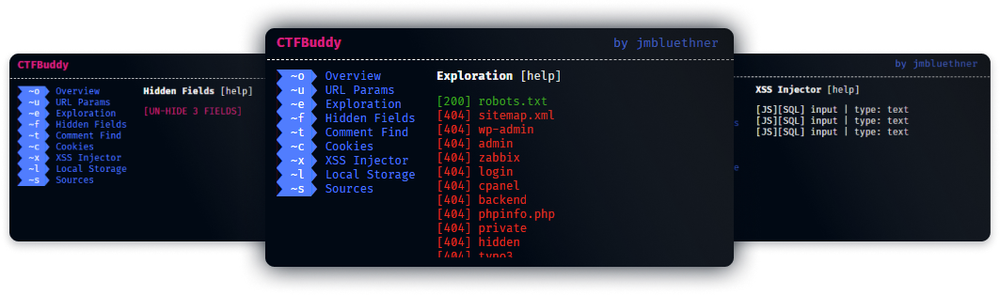
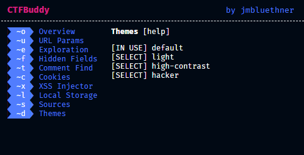
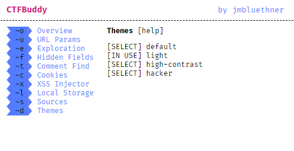
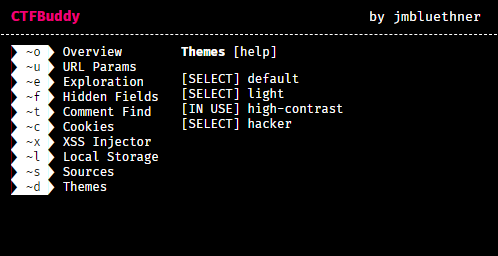
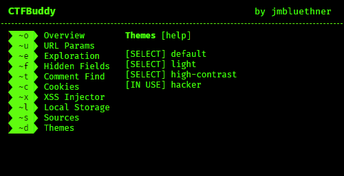

# CTFBuddy  

_An easy to use Chrome extension that helps you with online CTF's and general Web OSINT._  
_by jmbluethner_

---

# Project Aim

**CTFBuddy** is meant to be a little tool that sits in your Chrome extensions - Always ready to assist you with certain CTF and OSINT specific checks.  
When doing a lot of web focussed CTF's, you'll notice that in a lot of cases you do more or less the same basic checks. Such as analyzing URL Parameters to check for possible privilege or section escapes, hidden Input fields for value manipulation, and so on.  
In order to make those basic tasks a bit easier and to save you from repeating them over and over, I came up with **CTFBuddy**.  
**CTFBuddy** doesn't do anything super crazy that you couldn't do by hand, but it reduces your workload so that you don't have to check the HTML source code as many times as you'd usually have to.

# Features

- One-Click-Analytics tools for
  - Sub-Page exploration for common pages, such as `robots.txt`, `wp-admin` and so on.
  - Reporting and analysis for URL (GET) Parameters.
  - Finder for hidden input fields.
  - Detailed Cookie analysis.
  - Detailed Local Storage analysis.
  - Checks for all embedded sources, such as JS.
  - XSS Injection tester.
  - HTML Comment finder.
- Stylish CLI look.
- Menu navigation using keyboard shortcuts.
- Explaining help texts for each module.
- Solid codebase built on <a href="https://vuejs.org/">Vue.JS</a>.
- Support for custom Themes.

# Themes

**Default**

**Light**

**High Contrast**

**Hacker**

## Create your own theme

Creating your own theme is super easy!  

> It is recommended to work with `.less` files and using a client side file watcher to compile `less` to `css`. However, you can also just work with `css` files, as the theme loader will always look for `.css` and not `.less` files.

1. Copy `/src/css/colors.less` to `/src/themes/<your-theme-name>.less`
2. Edit your theme at `/src/themes/<your-theme-name>.less`.
3. Add your theme in the `themes` Array in `/src/views/router/themes.js` near or at line 6.

> File name and name in the `themes` array must match!

And that's it! Your theme will now appear in the `Themes` module.

---

_Developed with ♥️ and ☕ by jmbluethner_  
_Built with <a href="https://vuejs.org/">Vue.JS</a>_