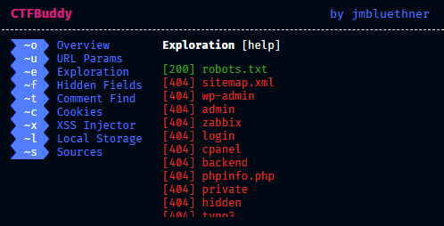

# CTFBuddy  

_An easy to use Chrome extension that helps you with online CTF's and general Web OSINT._  
_by jmbluethner_

---

[[_TOC_]]

# Project Aim

**CTFBuddy** is meant to be a little tool that sits in your Chrome extensions - Always ready to assist you with certain CTF and OSINT specific checks.  
When doing a lot of web focussed CTF's, you'll notice that in a lot of cases you do more or less the same basic checks. Such as analyzing URL Parameters to check for possible privilege or section escapes, hidden Input fields for value manipulation, and so on.  
In order to make those basic tasks a bit easier and to save you from repeating them over and over, I came up with **CTFBuddy**.

# Features

- One-Click-Analytics tools for
  - Automatic Sub-Page exploration for common pages, such as `robots.txt`, `wp-admin` and so on.
  - Automatic reporting and analysis for URL (GET) Parameters.
  - Detailed Cookie analysis.
  - Detailed Local Storage analysis.
  - Checks for all embedded sources, such as JS.
- Stylish CLI look